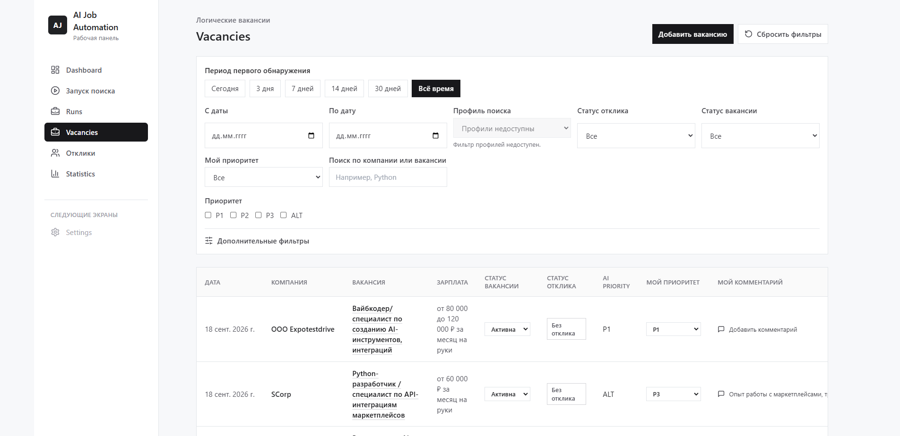
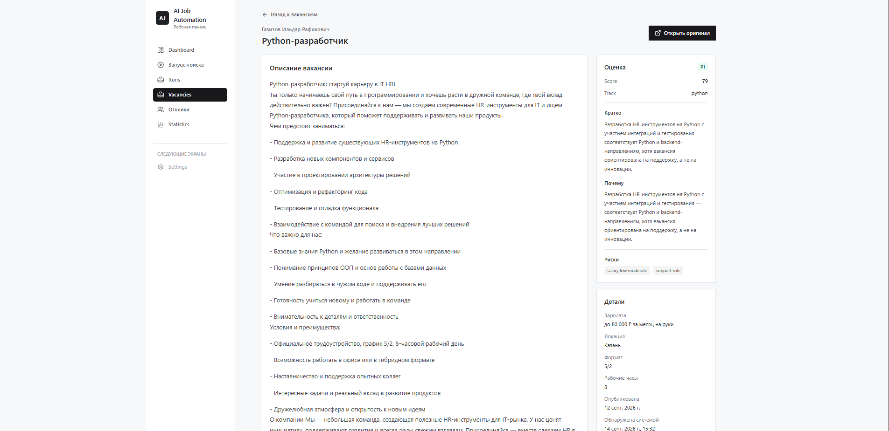
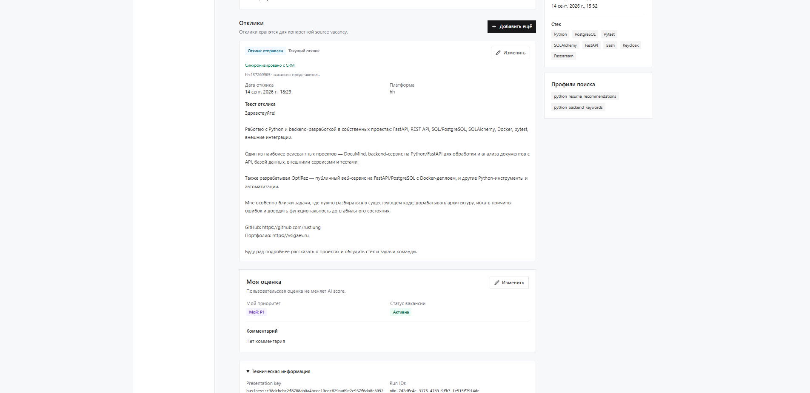
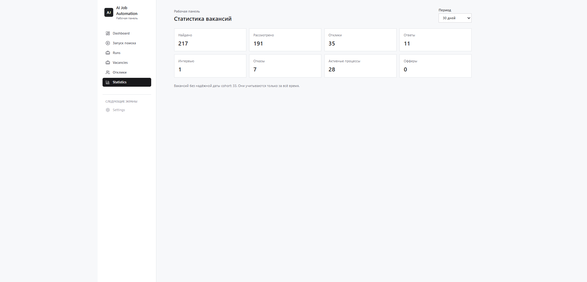
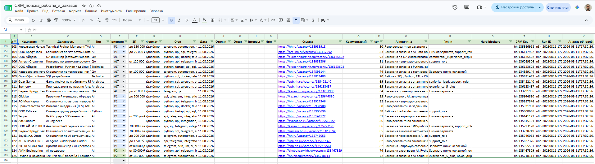
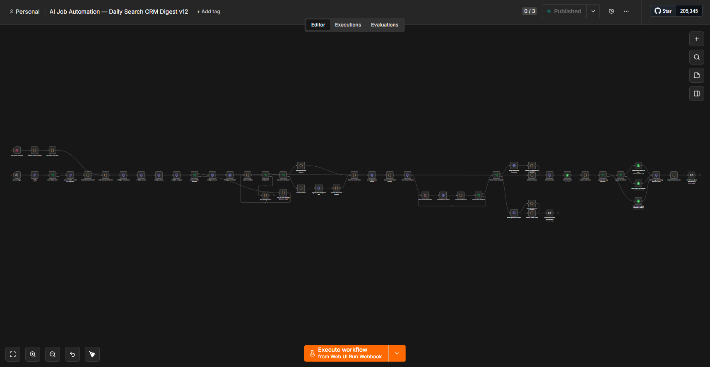

# AI Job Automation

Self-hosted система автоматизации и управления поиском работы. Она собирает вакансии с HH, пропускает их через локальный AI и детерминированный scoring, объединяет региональные дубли в logical vacancy, а затем даёт человеку рабочую среду для triage, откликов и контроля CRM.

**Orchestrator DB — source of truth. Google Sheets — вторичное CRM-представление.**

Автоматическая отправка откликов намеренно не реализована: решение и фактическая отправка всегда остаются за человеком.


## Что это

Поиск работы быстро превращается в поток похожих вакансий, вкладок, заметок и неполных таблиц. AI Job Automation берёт на себя повторяемую часть: сбор, фильтрацию, enrichment, объяснимую оценку и ведение единой базы. Пользователь работает уже с logical vacancies: расставляет собственный приоритет, оставляет комментарии, ведёт отклики и видит актуальную статистику.

Система рассчитана на self-hosted запуск: Worker с локальной моделью выполняет тяжёлую обработку, Orchestrator хранит состояние и обслуживает Web UI, n8n связывает сервисы с Google Sheets и Gmail.

## Что умеет система

### Discovery и AI

- собирает вакансии HH через resume recommendations и public keyword profiles;
- поддерживает preliminary local-AI filter с deterministic guardrails;
- загружает полные карточки перспективных вакансий;
- извлекает проверяемые признаки из текста вакансии;
- выполняет semantic assessment локальной моделью Ollama;
- рассчитывает итоговый score и AI priority `P1` / `P2` / `P3` / `ALT`;
- сохраняет историю analysis, provenance, processing events и PipelineRun.

### Управление вакансиями

- объединяет региональные и business-дубли в одну logical vacancy;
- показывает grouped Vacancy List и Vacancy Detail;
- хранит независимый от AI `VacancyUserState`: мой приоритет `P1` / `P2` / `P3`, статус `active` / `archived` / `closed` и комментарий;
- поддерживает inline triage в общем списке и редактирование в Detail;
- позволяет вручную добавить вакансию из HH, карьерного сайта, Telegram или прямого контакта.

### Отклики и интеграции

- ведёт несколько Applications для canonical vacancy: submitted, response received, screening, test task, interview, offer, rejected, withdrawn;
- показывает current Application для logical vacancy без потери истории;
- синхронизирует Applications и VacancyUserState с Google Sheets по DB-first модели;
- создаёт CRM-строку для manual vacancy и даёт controlled retry для внешних ошибок;
- формирует Gmail digest по результатам search run;
- использует versioned n8n workflows для внешних интеграций.

### Аналитика

- предоставляет Statistics Dashboard: найдено, рассмотрено, отклики, ответы, интервью, отказы, активные процессы и офферы;
- считает logical vacancies, а не региональные canonical copies;
- поддерживает периоды «Сегодня», 7 / 14 / 30 дней, всё время и произвольный диапазон.

## Как выглядит рабочий процесс

```text
HH вакансии                         Manual vacancy
    │                                      │
    ▼                                      ▼
Worker: collection → AI → scoring ──► Orchestrator DB ◄── Web UI triage
                                           │                    │
                                           ├── Applications ────┤
                                           ├── Statistics        │
                                           ▼                    ▼
                                      n8n integration workflows
                                           │
                               Google Sheets CRM + Gmail digest
```

1. Пользователь выбирает search profiles и запускает поиск через Web UI или manual trigger n8n.
2. Worker собирает HH-вакансии, применяет предварительный filter, enrichment, semantic assessment и deterministic scoring.
3. Orchestrator сохраняет canonical data, анализ и историю run.
4. Web UI показывает logical vacancies; пользователь быстро оценивает их и создаёт Application при реальном отклике.
5. После DB commit узкие CRM sync flows отражают изменения в Google Sheets. Внешняя ошибка остаётся видимой в sync state, но не отменяет DB-изменение.

## Web UI

Web UI — основной рабочий интерфейс системы, а не будущая надстройка над n8n.

### Vacancy List

Список показывает logical vacancies с AI priority, score, user priority, vacancy status, current Application и комментарием. Фильтры и сортировка выполняются backend-слоем; состояние фильтров синхронизировано с URL. Статус, личный приоритет и комментарий можно менять прямо в строке.



### Vacancy Detail и Applications

Detail раскрывает описание, результаты анализа, canonical members группы, историю Applications и пользовательскую оценку. Для manual vacancy отсутствие AI analysis является нормальным состоянием, а не ошибкой.





### Manual vacancy и Statistics

Из списка можно добавить вакансию вручную: компания, должность, описание, origin, ссылка и необязательные данные. Technical identity формируется сервером; manual vacancy не участвует в automatic business grouping и не отправляется в AI pipeline.

Statistics Dashboard использует cohort по дате нахождения или добавления вакансии и показывает текущий результат работы с этой cohort.



## AI pipeline: семантика плюс deterministic правила

LLM не принимает решение об отклике целиком. Она отвечает за semantic assessment, а итоговая оценка остаётся контролируемой Python-логикой.

```text
Normalized vacancy
        │
        ▼
Deterministic feature extraction
        │
        ▼
Local semantic assessment
        │
        ▼
Deterministic scoring, hard blockers и priority
```

Детерминированный слой учитывает salary, geography, work format, experience, seniority, technical signals и hard blockers. Локальная модель оценивает смысловую релевантность роли, target track и контекст ответственности. Такое разделение делает результат объяснимее и уменьшает зависимость от одного вероятностного ответа модели.

## Logical vacancy grouping

Каждая исходная вакансия имеет canonical identity `source + external_id`. Для UI, CRM и statistics региональные HH-копии одной business vacancy могут быть объединены в presentation group с одним `presentation_key`.

Это даёт два практических эффекта:

- региональные дубли не раздувают список, CRM и статистику;
- пользовательский priority, статус, комментарий и current Application видны на уровне logical vacancy, а не теряются на representative-регионе.

Manual vacancies имеют собственную singleton identity `manual:<UUID>` и не участвуют в automatic grouping. Внутренние fingerprint и reconciliation mechanics намеренно остаются за пределами публичного интерфейса.

## Applications и пользовательское состояние

`VacancyUserState` существует отдельно от AI evaluation. Например, AI может назначить `P1`, а пользователь — `P3`; это валидная и полезная для последующего анализа ситуация.

Пользователь может:

- задать или снять личный приоритет;
- перевести vacancy в active, archived или closed;
- добавить, изменить или очистить комментарий;
- создать и обновлять Application без жёсткой связи между vacancy status и application status.

Application принадлежит конкретной canonical vacancy, но в grouped интерфейсе система собирает Applications всех members и детерминированно выбирает current record. История не перезаписывается.

## CRM synchronization

Google Sheets CRM не является prerequisite для успешного сохранения в продукте.

```text
Validate user action
        │
        ▼
Commit Orchestrator DB
        │
        ▼
Call narrow n8n CRM workflow
        │
        ├── synced
        └── failed / pending → controlled retry
```

Так синхронизируются:

- Application facts и даты: отклик, ответ, интервью, итог и заметки;
- VacancyUserState: мой приоритет, vacancy status и комментарий;
- новая строка manual vacancy с CRM Key `manual:<UUID>`.

CRM reconciliation использует exact keys и controlled fallback для исторических HH-строк; fuzzy matching по company/title не применяется. В случае ошибки Google Sheets DB state остаётся сохранённым, а UI показывает безопасный sync status и retry. Existing Google Sheets column layout не перестраивается.



## Manual vacancies

Ручная вакансия предназначена для источников вне обычного search pipeline: HH-ссылка, company site, Habr, Telegram, direct contact или другой источник.

- backend генерирует `source=manual` и UUID external id;
- `origin` хранит фактическое происхождение, но не участвует в identity;
- URL опционален;
- если для origin HH ссылка точно совпадает с уже известной HH vacancy, backend возвращает controlled duplicate result вместо создания копии;
- vacancy сразу совместима с UserState, Applications и CRM row creation;
- AI analysis для manual vacancy намеренно не запускается.

## Statistics

Statistics Dashboard не строит conversion funnel и не восстанавливает исторические даты. Для ограниченного периода в cohort попадают только logical vacancies с надёжной датой: `first_seen` для найденных вакансий и `created_at` для manual vacancies. Legacy records без надёжной cohort date доступны в «Всё время» и учитываются отдельно.

Метрики отражают **текущее** состояние выбранной cohort:

- **Найдено** — размер cohort logical vacancies;
- **Рассмотрено** — есть user priority;
- **Отклики / Ответы / Интервью** — Application достиг соответствующей стадии;
- **Отказы / Офферы** — текущий Application имеет terminal outcome;
- **Активные процессы** — current Application ещё не завершён rejected, offer или withdrawn.

## Архитектура


```text
                    ┌───────────────────┐
                    │  HH / manual input │
                    └─────────┬─────────┘
                              │
          ┌───────────────────▼────────────────────┐
          │ Worker                                  │
          │ collection, local AI, enrichment, score │
          └───────────────────┬────────────────────┘
                              │
                    ┌─────────▼─────────┐
                    │ Orchestrator API  │
                    │ SQLite + Alembic  │
                    └──────┬─────┬──────┘
                           │     │
                  ┌────────▼─┐ ┌─▼─────────────────┐
                  │ React UI │ │ n8n integrations  │
                  └──────────┘ └──────┬────────────┘
                                       │
                            ┌──────────▼──────────┐
                            │ Google Sheets / Gmail│
                            └─────────────────────┘
```

n8n остаётся integration/orchestration layer: запускает full search workflow, выполняет preflight, связывает сервисы с Google Sheets и отправляет digest. Он не является центром domain state, не выполняет AI scoring и не хранит canonical vacancy data.

## Основные компоненты

| Компонент | Роль |
| --- | --- |
| **Worker** | FastAPI-сервис на Windows: HH collection, Playwright/httpx, Ollama, filtering, enrichment и scoring. |
| **Orchestrator API** | FastAPI + SQLAlchemy + SQLite: canonical data, application/user state, Web API, CRM sync state и Alembic migrations. |
| **React Web UI** | TypeScript, React Query и React Router: daily triage, runs, vacancies, applications, manual create и statistics. |
| **n8n** | Versioned workflows для search orchestration, узких CRM sync операций и Gmail digest. |
| **Google Sheets / Gmail** | Вторичная CRM-витрина и уведомления, не primary datastore. |

## Надёжность и эксплуатационные принципы

- Preflight проверяет доступность Orchestrator, Worker, Ollama и требуемый GPU compute; HH auth/session проверяется только для resume profiles.
- Worker изолирует ошибки на уровне vacancy и допускает controlled partial completion вместо потери всего batch.
- Canonical upsert, analysis persistence и CRM workflows идемпотентны по их exact identity.
- Синхронизации следуют DB-first boundary: внешний failure не откатывает успешно сохранённые product data.
- Для CRM state предусмотрены `pending`, `synced`, `failed`, safe error code и retry.
- Alembic управляет схемой SQLite; production update требует backup перед migration.
- Backend и frontend покрыты automated tests; workflow exports versioned и не содержат credentials.

## Стек

**Backend:** Python 3.12, FastAPI, Pydantic, SQLAlchemy, Alembic, SQLite.

**Frontend:** React, TypeScript, Vite, TanStack Query, React Router, Tailwind CSS, Vitest.

**AI и collection:** Ollama, `qwen3:4b-instruct`, structured output, httpx, Playwright, Chromium.

**Automation и интеграции:** n8n, Google Sheets API, Gmail OAuth.

**Infrastructure:** Docker Compose, Windows 11 Worker, homeserver deployment, Nginx и HTTPS для n8n.

## Deployment

README даёт обзор, а не заменяет operational runbook. Orchestrator, Worker и Web UI разворачиваются отдельными Docker Compose конфигурациями; n8n хранит credentials вне workflow exports. Перед обновлением production SQLite создаётся backup, затем применяется Alembic migration и выполняются health checks.

Подробности: [Deployment guide](docs/deployment.md).

## Безопасность

- `.env`, OAuth tokens, service-account keys и HH browser storage state не хранятся в Git;
- frontend общается только с Orchestrator `/api/...`, не получает Worker/n8n secrets;
- Worker и Orchestrator остаются LAN services; публичный HTTPS нужен n8n;
- workflow exports не содержат credentials;
- логи не должны включать cookies, auth headers, raw HTML, полные prompts, raw AI responses и персональные данные.

## Ограничения

- Автоматическая отправка откликов отсутствует намеренно.
- Automatic collection сейчас ориентирован на HH; manual creation закрывает другие источники без AI pipeline.
- Quality AI filter/scoring требует регулярной calibration на реальных результатах.
- HH HTML, auth/session и антибот-механизмы могут изменяться и требуют operational monitoring.
- Worker рассчитан на on-demand использование и один тяжёлый pipeline run за раз.
- Google Sheets — зеркало, поэтому CRM ошибка требует retry, но не меняет DB source of truth.

## Возможное развитие

- calibration scoring и AI/user feedback analytics;
- дополнительные source collectors;
- расширение reporting без отказа от logical-vacancy semantics;
- оценка более крупных локальных моделей и controlled cloud fallback;
- PostgreSQL при необходимости масштаба или многопользовательского сценария;
- дополнительные каналы уведомлений.

## Документация

- [Architecture](docs/architecture.md)
- [Current State](docs/current-state.md)
- [API](docs/api.md)
- [Workflows](docs/workflows.md)
- [Deployment](docs/deployment.md)
- [Changelog](docs/changelog.md)
- [Roadmap](docs/project-roadmap-v1.1.md)

## Скриншоты в репозитории

README использует актуальные пути `assets/ai-job-automation-hero.png`, `assets/web-vacancies.png`, `assets/web-vacancy-detail-overview.png`, `assets/web-vacancy-detail-applications.png`, `assets/web-statistics.png`, `assets/n8n-daily-workflow.png`, `assets/crm-sheet.png`, `assets/email-digest.png` и `assets/ai-job-automation-architecture.png`.




