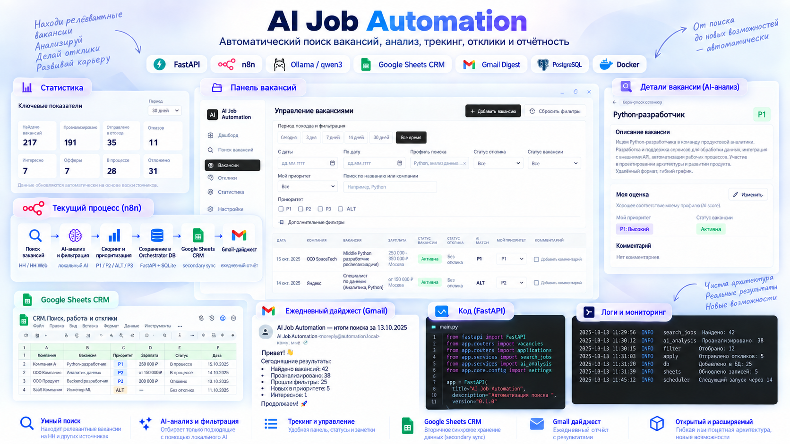
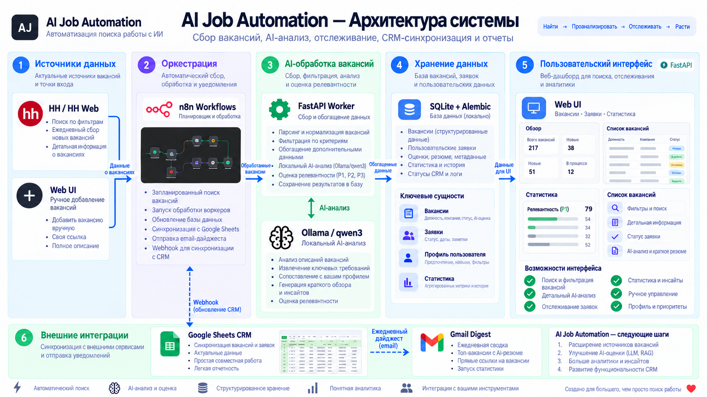
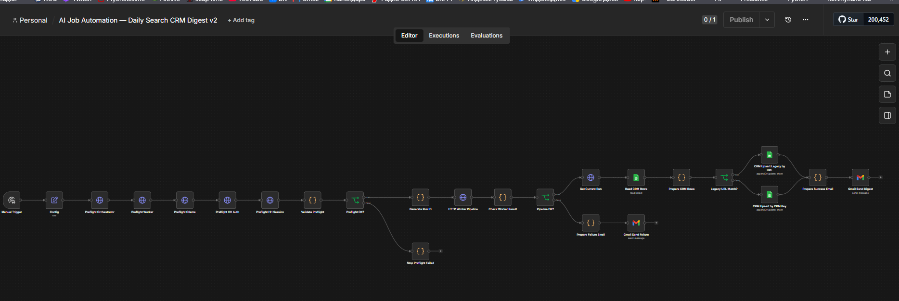
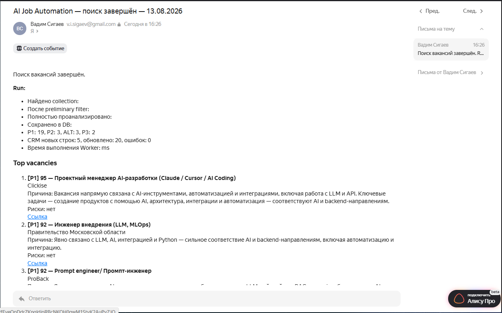
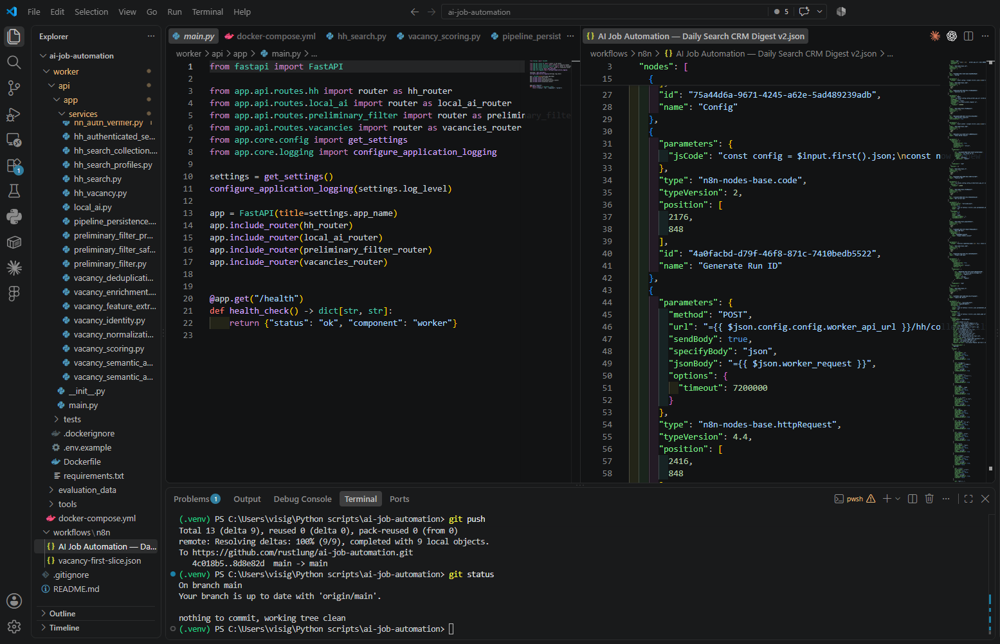
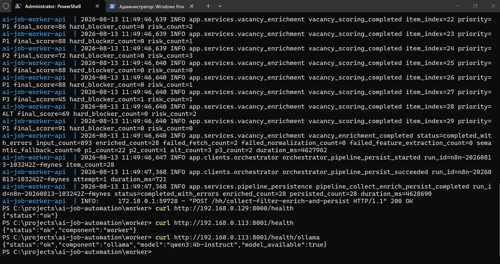

# AI Job Automation

Self-hosted AI automation system для поиска, фильтрации, анализа и
приоритизации вакансий.

Система собирает вакансии с HH, предварительно фильтрует их локальной LLM,
загружает полные карточки перспективных вакансий, рассчитывает объяснимый score,
сохраняет историю в Orchestrator DB, обновляет Google Sheets CRM и отправляет
email digest.

```text
HH → Local AI → Scoring → Orchestrator DB → CRM → Email Digest
```

Ключевые факты:

- self-hosted архитектура;
- local-first AI через Ollama и `qwen3:4b-instruct`;
- Python 3.12, FastAPI, Pydantic, SQLAlchemy, Alembic;
- n8n orchestration;
- Google Sheets CRM и Gmail digest;
- ручной production workflow для on-demand Worker laptop;
- Orchestrator DB как source of truth.



## Зачем нужен проект

При ручном поиске работы приходится просматривать сотни вакансий, большая часть
которых нерелевантна. Это занимает часы, плохо масштабируется, быстро утомляет и
повышает риск пропустить хорошую вакансию.

AI Job Automation автоматизирует discovery, filtering и analysis, но оставляет
ответственное решение об отклике человеку. Автоматическая отправка откликов
намеренно не реализована.

## Что умеет система

- HH search collection;
- authenticated resume recommendations;
- public expanded search;
- custom keyword search profiles;
- configurable n8n profile selection;
- pagination;
- exact deduplication;
- preliminary local AI filter;
- deterministic guardrails;
- full vacancy enrichment;
- semantic local AI analysis;
- deterministic scoring;
- priority `P1 / P2 / P3 / ALT`;
- persistent analysis history;
- run history и processing events;
- Google Sheets CRM sync;
- Gmail digest;
- preflight health checks;
- partial failure tolerance.

## Реальный production run

Проект дошел до рабочего MVP и прошел full manual production run без acceptance
overrides.

Пример одного production run:

- использовались два resume recommendation profile;
- Worker обработал большой реальный batch;
- preliminary filter прошел полный batch в рамках production safety cap;
- перспективные вакансии дошли до full enrichment, semantic analysis и scoring;
- результаты сохранены в Orchestrator DB;
- production CRM sheet обновлен;
- Gmail digest отправлен;
- полный run занял порядка 40 минут.

Это пример фактического production run, а не benchmark и не SLA. Время зависит
от размера batch, состояния HH, локальной модели и ресурсов Worker laptop.

## Почему LLM не принимает всё решение

Ключевая инженерная идея проекта: LLM используется не как единственный судья, а
как часть гибридного pipeline.

```text
Normalized Vacancy
↓
Deterministic Python extraction
↓
Compact facts
↓
Local Qwen semantic assessment
↓
Deterministic Python scoring
↓
P1 / P2 / P3 / ALT
```

Python отвечает за проверяемые признаки:

- salary;
- geography;
- office / relocation;
- experience;
- seniority;
- technical signals;
- hard blockers;
- final score и priority.

LLM отвечает за смысловую оценку:

- semantic task fit;
- role nature;
- target track;
- responsibility level;
- short reason.

Такой подход повышает explainability, стабильность, reproducibility и
устойчивость небольшой локальной модели.

## Архитектура



```text
HH
↓
Worker
├── collection
├── preliminary AI
├── full enrichment
├── deterministic extraction
├── semantic analysis
└── scoring
↓
Orchestrator API
↓
SQLite
↓
n8n
├── Google Sheets CRM
└── Gmail Digest
```

Worker — compute layer. Он собирает данные, парсит HH, запускает локальный AI,
делает enrichment/scoring и отправляет результат в Orchestrator.

Orchestrator — persistence layer и source of truth. Он хранит вакансии, историю
анализа, processing events и результаты pipeline runs.

n8n — orchestration и external integrations. Он запускает production workflow,
выполняет preflight, вызывает Worker, читает current run из Orchestrator,
синхронизирует CRM и отправляет digest.

Worker и Orchestrator остаются LAN-only. Наружу опубликован только n8n через
HTTPS.

## Компоненты

### Worker

Windows 11, Docker, FastAPI, Playwright, httpx, Ollama,
`qwen3:4b-instruct`.

Responsibilities:

- HH collection;
- parsing;
- deduplication;
- normalization;
- AI filtering;
- full vacancy enrichment;
- scoring;
- persistence bridge.

### Orchestrator

FastAPI, SQLAlchemy, Alembic, SQLite.

Responsibilities:

- Vacancy persistence;
- VacancyAnalysis history;
- processing events;
- run history;
- read API;
- source of truth для автоматических pipeline data.

### n8n

Responsibilities:

- Manual Trigger;
- preflight;
- Worker pipeline call;
- current run retrieval;
- Google Sheets CRM sync;
- Gmail digest.

## n8n workflow



```text
Manual Trigger
→ Search Profiles
→ Conditional Preflight
→ Worker Pipeline
→ Orchestrator
→ CRM
→ Email
```

Workflow запускается вручную, потому что Worker laptop является on-demand
compute node и не работает постоянно. Schedule Trigger намеренно не используется
в production process.

### Выбор профилей перед запуском

Перед `Manual Trigger` откройте ноду `Search Profiles — EDIT BEFORE RUN` и
установите `true` только для нужных направлений поиска. Не редактируйте массив
`profile_ids` вручную: следующая техническая нода формирует его из отмеченных
значений.

```json
{
  "ai_resume_recommendations": true,
  "python_resume_recommendations": true,
  "ai_automation_keywords": true,
  "vibecoding_keywords": false,
  "python_backend_keywords": false,
  "python_automation_keywords": false
}
```

Если все профили имеют значение `false`, workflow завершится до вызова Worker с
ошибкой `No search profiles selected`. Только keyword profiles используют public
HH search и пропускают HH auth/session preflight. Выбор хотя бы одного resume
profile включает существующий строгий live preflight авторизации HH и resume
context.

## CRM


Google Sheets — пользовательская CRM-витрина, а не source of truth. Источник
автоматических данных остается в Orchestrator DB.

В CRM синхронизируются `P1`, `P2` и `ALT`. `P3` остается DB-only, чтобы таблица
не превращалась в архив слабых вакансий.

User-managed fields сохраняются:

- `Отклик`;
- `Ответ`;
- `Интервью`;
- `Итог`;
- `Комментарий`.

CRM Key имеет формат:

```text
source:external_id
```

Legacy URL matching поддерживает старые строки CRM без CRM Key: workflow
извлекает HH external id из URL, обновляет существующую строку и добавляет CRM
Key без дубля.

## Email digest



После run пользователь получает summary:

- run status;
- collection/filter/enrichment/persistence counts;
- `P1/P2/ALT/P3`;
- CRM stats;
- top vacancies;
- short reasons;
- risks;
- links.

Preflight failure не отправляет Gmail failure email: пользователь запускает
workflow вручную и сразу видит ошибку в n8n UI.

## Реализация



Кодовая база разделена по компонентам:

```text
ai-job-automation/
├── worker/
├── orchestrator/
├── workflows/
└── docs/
```

## Reliability and observability



Перед долгим run preflight проверяет:

- Orchestrator;
- Worker API;
- Ollama;
- HH auth storage и live HH session, только если выбран resume profile.

Workflow v4 содержит ноду `Search Profiles — EDIT BEFORE RUN` с boolean
selection resume и keyword profiles. Keyword-only run использует public
`expanded_search`/`httpx` path и не требует HH storage state; при выборе resume
profile сохраняется strict live HH preflight.

Это важно из-за реального production edge case: при включенном VPN HH browser
мог попадать на `/vpncheeck`, и resume context не подтверждался. Preflight
обнаруживает такую проблему до запуска длинного pipeline.

Одна проблемная vacancy не должна ронять весь batch. Pipeline поддерживает
`completed_with_errors`, per-vacancy isolation и controlled fallbacks:

```text
AI failure
↓
uncertain / fallback
↓
vacancy не теряется
```

## Стек

Backend:

- Python 3.12;
- FastAPI;
- Pydantic;
- SQLAlchemy;
- Alembic.

AI:

- Ollama;
- `qwen3:4b-instruct`;
- structured output;
- deterministic + semantic hybrid analysis.

Automation:

- n8n.

Data:

- SQLite;
- Google Sheets.

Integration:

- Gmail OAuth;
- Google Service Account.

Collection:

- httpx;
- Playwright;
- Chromium.

Infrastructure:

- Docker;
- Nginx;
- Let's Encrypt;
- Ubuntu Server;
- Windows 11 Worker.

## Как запускается

README не заменяет deployment manual. В рабочем процессе:

1. Поднимается Orchestrator.
2. Запускается Worker.
3. Проверяется доступность Ollama.
4. При необходимости обновляется HH auth state.
5. n8n workflow запускается вручную через Manual Trigger.
6. Preflight подтверждает инфраструктуру.
7. Worker выполняет длинный pipeline.
8. Orchestrator сохраняет результаты.
9. CRM обновляется.
10. Gmail отправляет digest.

### Обновление HH-сессии

Authenticated resume recommendations используют Playwright storage state. Этот
файл хранится локально вне Git и периодически перестает быть валидным: само
наличие storage state файла не означает, что HH-сессия еще рабочая.

На Windows Worker сессия обновляется вручную:

```powershell
cd worker
.\api\.venv\Scripts\python.exe .\tools\hh_auth_setup.py
```

После ручной авторизации в открывшемся Chromium storage state обновляется
локально. Затем Worker нужно перезапустить:

```powershell
docker compose restart api
```

Перед production run n8n выполняет live preflight: проверяет фактическую
авторизацию HH и resume context. Если HH session invalid, основной pipeline не
запускается. Failed HH preflight нельзя обходить без понимания причины:
истекшая HH-сессия может привести к неперсонализированной или нерелевантной
выдаче.

Подробности: [docs/deployment.md](docs/deployment.md).

## Безопасность

- `.env` не хранится в Git;
- HH storage state находится вне Git;
- OAuth tokens не попадают в workflow export;
- Google credentials не экспортируются в repository;
- Worker и Orchestrator остаются LAN-only;
- n8n доступен через HTTPS;
- secrets, raw prompts, raw AI responses и storage state не должны логироваться.

## Ограничения текущей версии

- scoring требует дальнейшей calibration;
- keyword search требует filter calibration для нерелевантных ролей с
  поверхностным упоминанием AI;
- regional/business near-duplicate suppression для разных HH external id пока
  отсутствует;
- локальная модель небольшая;
- HTML HH может измениться;
- HH auth state периодически нужно обновлять вручную;
- cross-source deduplication отсутствует;
- automatic applications intentionally not implemented;
- cloud AI fallback пока не является частью MVP;
- Telegram notification пока отсутствует.

## Возможное развитие

Это optional future improvements, а не blockers текущего MVP:

- scoring calibration;
- filter calibration для keyword search;
- near-duplicate grouping для CRM/Web UI;
- безопасный `GET /hh/search-profiles` для будущего Web UI;
- larger/local model evaluation;
- LoRA / QLoRA / PEFT experiments;
- expanded search;
- Telegram;
- web UI;
- cloud fallback;
- PostgreSQL;
- cross-source collectors.

## Документация

- [Architecture](docs/architecture.md)
- [Current State](docs/current-state.md)
- [API](docs/api.md)
- [Deployment](docs/deployment.md)
- [Workflows](docs/workflows.md)
- [Roadmap](docs/project-roadmap-v1.1.md)
- [Project Context](docs/project-context.md)
- [Project History](docs/project-history.md)
